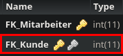

Method: `deletearbeitetbykkey`
Der Endpoint `deletearbeitetbykkey` kann in `arbeitet` löschen.
Dieser Endpunkt muss mit folgenden Parametern aufgerufen werden:
`key`(Rot markiert im Bild) mit Type `integer`