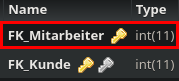

Method: `deletearbeitetbymkey`
Der Endpoint `deletearbeitetbymkey` kann in `arbeitet` löschen.
Dieser Endpunkt muss mit folgenden Parametern aufgerufen werden:
`key`(Rot markiert im Bild) mit Type `integer`