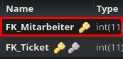

Method: `deletebearbeitetbymkey`
Der Endpoint `deletebearbeitetbymkey` kann in `bearbeitet` löschen.
Dieser Endpunkt muss mit folgenden Parametern aufgerufen werden:
`key`(Rot markiert im Bild) mit Type `integer`