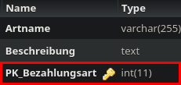

Method: `deletebezahlungsartmain`
Der Endpoint `deletebezahlungsartmain` kann in `bezahlungsart` löschen.
Dieser Endpunkt muss mit folgenden Parametern aufgerufen werden:
`key`(Rot markiert im Bild) mit Type `integer`