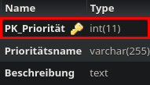

Method: `deleteprioritaetmain`
Der Endpoint `deleteprioritaetmain` kann in `prioritaet` löschen.
Dieser Endpunkt muss mit folgenden Parametern aufgerufen werden:
`key`(Rot markiert im Bild) mit Type `integer`