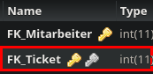

Method: `getbearbeitetbytkey`
Der Endpoint `getbearbeitetbytkey` kann in `bearbeitet` holen.
Dieser Endpunkt muss mit folgenden Parametern aufgerufen werden:
`key`(Rot markiert im Bild) mit Type `integer`