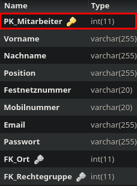

Method: `getmitarbeiterbykey`
Der Endpoint `getmitarbeiterbykey` kann in `mitarbeiter` holen.
Dieser Endpunkt muss mit folgenden Parametern aufgerufen werden:
`key`(Rot markiert im Bild) mit Type `integer`