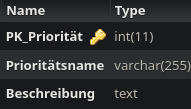

Method: `getprioritaetbykey`
Der Endpoint `getprioritaetbykey` kann in `prioritaet` holen.
Dieser Endpunkt muss mit folgenden Parametern aufgerufen werden:
`key`(Rot markiert im Bild) mit Type `integer`