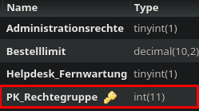

Method: `getrechtegruppebykey`
Der Endpoint `getrechtegruppebykey` kann in `rechtegruppe` holen.
Dieser Endpunkt muss mit folgenden Parametern aufgerufen werden:
`key`(Rot markiert im Bild) mit Type `integer`