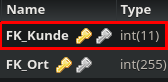

Method: `getresidiertbykkey`
Der Endpoint `getresidiertbykkey` kann in `residiert` holen.
Dieser Endpunkt muss mit folgenden Parametern aufgerufen werden:
`key`(Rot markiert im Bild) mit Type `integer`