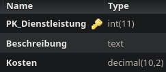

Method: `setdienstleistungmain`
Der Endpoint `setdienstleistungmain` kann in `dienstleistung` erstellen.
Dieser Endpunkt muss mit folgenden Parametern aufgerufen werden:
`beschreibung` mit Type `string`
`kosten` mit Type `double`