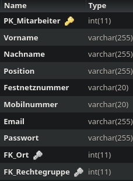

Method: `setmitarbeitermain`
Der Endpoint `setmitarbeitermain` kann in `mitarbeiter` erstellen.
Dieser Endpunkt muss mit folgenden Parametern aufgerufen werden:
`vorname` mit Type `string`
`nachname` mit Type `string`
`position` mit Type `string`
`festnetznummer` mit Type `string`
`mobilnummer` mit Type `string`
`email` mit Type `string`
`passwort` mit Type `string`
`fk_ort` mit Type `integer`
`fk_rechtegruppe` mit Type `integer`
`fk_kunde` mit Type `integer`