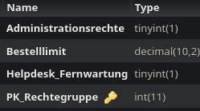

Method: `setrechtegruppemain`
Der Endpoint `setrechtegruppemain` kann in `rechtegruppe` erstellen.
Dieser Endpunkt muss mit folgenden Parametern aufgerufen werden:
`Administrationsrechte` mit Type `integer`
`Bestelllimit` mit Type `double`
`Helpdesk_Fernwartung` mit Type `integer`