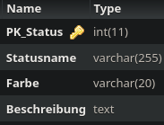

Method: `setstatusmain`
Der Endpoint `setstatusmain` kann in `status` erstellen.
Dieser Endpunkt muss mit folgenden Parametern aufgerufen werden:
`Statusname` mit Type `string`
`Farbe` mit Type `string`
`Beschreibung` mit Type `string`