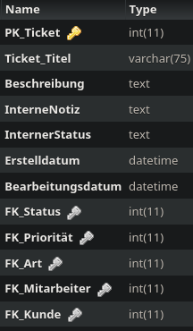

Method: `setticketmain`
Der Endpoint `setticketmain` kann in `ticket` erstellen.
Dieser Endpunkt muss mit folgenden Parametern aufgerufen werden:
`Ticket_Titel` mit Type `string`
`Beschreibung` mit Type `string`
`InterneNotiz` mit Type `string`
`InternerStatus` mit Type `string`
`Erstelldatum` mit Type `string`
`Bearbeitungsdatum` mit Type `string`
`FK_Status` mit Type `integer`
`FK_Prioritaet` mit Type `integer`
`FK_Art` mit Type `integer`
`FK_Mitarbeiter` mit Type `integer`
`FK_Kunde` mit Type `integer`
`fk_dienstleistung` mit Type `array`