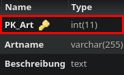

Method: `updateartmain`
Der Endpoint `updateartmain` kann in `art` aktualisieren.
Dieser Endpunkt muss mit folgenden Parametern aufgerufen werden:
`Beschreibung` mit Type `string`
`Artname` mit Type `string`
`key`(Rot markiert im Bild) mit Type `integer`