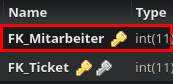

Method: `updatebearbeitetbymkey`
Der Endpoint `updatebearbeitetbymkey` kann in `bearbeitet` aktualisieren.
Dieser Endpunkt muss mit folgenden Parametern aufgerufen werden:
`new_FK_Ticket` mit Type `integer`
`FK_Mitarbeiter` mit Type `integer`