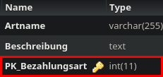

Method: `updatebezahlungsartmain`
Der Endpoint `updatebezahlungsartmain` kann in `bezahlungsart` aktualisieren.
Dieser Endpunkt muss mit folgenden Parametern aufgerufen werden:
`Beschreibung` mit Type `string`
`Artname` mit Type `string`
`PK_Bezahlungsart` mit Type `integer`