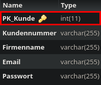

Method: `updatekundemain`
Der Endpoint `updatekundemain` kann in `kunde` aktualisieren.
Dieser Endpunkt muss mit folgenden Parametern aufgerufen werden:
`Kundennummer` mit Type `string`
`Firmenname` mit Type `string`
`Email` mit Type `string`
`Passwort` mit Type `string`
`PK_Kunde` mit Type `integer`