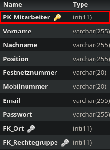

Method: `updatemitarbeitermain`
Der Endpoint `updatemitarbeitermain` kann in `mitarbeiter` aktualisieren.
Dieser Endpunkt muss mit folgenden Parametern aufgerufen werden:
`Vorname` mit Type `string`
`Nachname` mit Type `string`
`Position` mit Type `string`
`Festnetznummer` mit Type `string`
`Mobilnummer` mit Type `string`
`Email` mit Type `string`
`Passwort` mit Type `string`
`FK_Ort` mit Type `integer`
`FK_Rechtegruppe` mit Type `integer`
`PK_Mitarbeiter` mit Type `integer`
`FK_Kunde` mit Type `integer`