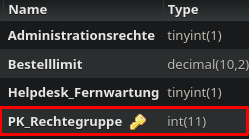

Method: `updaterechtegruppemain`
Der Endpoint `updaterechtegruppemain` kann in `rechtegruppe` aktualisieren.
Dieser Endpunkt muss mit folgenden Parametern aufgerufen werden:
`Administrationsrechte` mit Type `integer`
`Bestelllimit` mit Type `double`
`Helpdesk_Fernwartung` mit Type `integer`
`PK_Rechtegruppe` mit Type `integer`