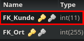

Method: `updateresidiertbykkey`
Der Endpoint `updateresidiertbykkey` kann in `residiert` aktualisieren.
Dieser Endpunkt muss mit folgenden Parametern aufgerufen werden:
`FK_Ort` mit Type `integer`
`FK_Kunde` mit Type `integer`